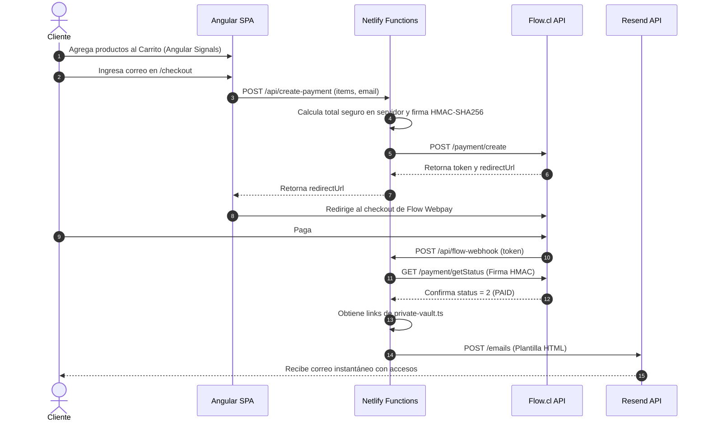

# Skill: La Profe GPT E-Commerce

Esta skill contiene todo el conocimiento contextual, técnico, de seguridad y de negocio necesario para comprender, extender o mantener la plataforma e-commerce de **La Profe GPT** ([https://laprofegpt.cl/](https://laprofegpt.cl/)).

---

## 📌 1. Identidad de Marca y Modelo de Negocio

* **Marca**: **La Profe GPT** / **ProfeGPT**
* **Público Objetivo**: Docentes y educadores en Chile preparando la Evaluación Docente, el **Portafolio Docente 2026** y la **Prueba de Conocimientos Específicos y Pedagógicos (ECEP 2026)** del CPEIP.
* **Propuesta de Valor**: Asistentes virtuales impulsados por IA (Custom GPTs) y dossiers de estudio descargables (PDFs) organizados por nivel, asignatura y especialidad.
* **Catálogo (39 Productos)**:
  1. **Portafolio Docente 2026** (Básica, Media, Diferencial PIE, Escuela Especial, Parvularia, Técnico Profesional).
  2. **Asistentes ECEP 2026** (Asignaturas y niveles específicos).
  3. **Dossiers ECEP 2026** (Materiales de estudio descargables en PDF - $15.000 CLP).
  4. **Biblioteca de la Profe GPT** (Materiales semanales - $5.000 CLP).

---

## 🏗️ 2. Arquitectura de Tecnologías

* **Frontend**: Angular 18 (Standalone Components, Signals reactivos para estado de Carrito, Router con Lazy Loading, HttpClient).
* **Estilos**: Tailwind CSS con sistema de diseño oficial de la marca:
  * `profe-purple` (`#6B4FBB`), `profe-purple-dark` (`#4A3490`), `profe-purple-light` (`#EDE9FF`)
  * `profe-pink` (`#E8607A`), `profe-pink-dark` (`#B5194A`), `profe-pink-light` (`#FFF0F3`)
  * `profe-cream` (`#FDF5FF`), `profe-text` (`#1E1040`), `profe-muted` (`#6B6280`)
  * Tipografía: Google Fonts `Nunito` y `Outfit`.
* **Hosting**: Netlify Free Tier ($0/mes fijo).
* **Backend Serverless**: Netlify Functions (TypeScript / Node.js).
* **Pasarela de Pagos**: **Flow.cl** (Webpay, Servipag, BancoEstado, TC) mediante API v1 con firmas criptográficas HMAC-SHA256.
* **Envío Transaccional**: **Resend API** (3.000 correos/mes en Free Tier).
* **DevOps**: GitHub CI/CD + Docker (`Dockerfile` y `docker-compose.yml`).

---

## 🔒 3. Modelo de Seguridad Anti-Robo de Productos Digitales

El proyecto implementa un principio estricto de **Zero-Trust Client Data**:

1. **Catálogo Público (`src/assets/data/products.json`)**:
   * El archivo consumido por Angular **SOLO** contiene metadatos públicos (`id`, `name`, `category`, `priceCLP`, `flowToken`, `emoji`, `description`).
   * **CERO URLs de Custom GPTs o enlaces a PDFs**. NINGÚN cliente ni bot puede extraer los productos inspeccionando el código fuente o bundle JS.

2. **Bóveda Privada Backend (`netlify/functions/shared/private-vault.ts`)**:
   * Vive únicamente en el servidor serverless.
   * Contiene el mapeo confidencial de cada `productId` a su recurso:
     - **Custom GPTs**: (`digitalType: 'gpt_url'`, `digitalUrl: 'https://chatgpt.com/g/g-...'`).
     - **Documentos Directos (PDF, Word, Docs)**: (`digitalType: 'file_attachment'`, `attachmentPath: 'https://...'` o ruta privada).
3. **Despacho Automático de Archivos Adjuntos**:
   * El servicio de correo (`email-service.ts`) consume la API de Resend. Cuando el cliente adquiere dossiers o documentos, la función obtiene el binario y lo incrusta como **adjunto directo en el correo** (`attachments: [{ filename, content }]`), evitando redirigir a visores externos como Google Drive.

3. **Verificación Servidor a Servidor**:
   * Las entregas solo ocurren cuando el webhook serverless (`flow-webhook.ts`) verifica directamente con la API de Flow (`/payment/getStatus`) que el estado es `2` (PAID).

---

## ⚡ 4. Flujo de Pago y Entrega Automática



---

## 🔑 5. Variables de Entorno y Credenciales

### Desarrollo Local (`.env`)
El archivo `.env` está registrado en `.gitignore` para evitar filtraciones en GitHub:

```ini
SITE_URL=http://localhost:8888
FLOW_API_KEY=tu_api_key
FLOW_SECRET_KEY=tu_secret_key
FLOW_API_URL=https://sandbox.flow.cl/api
RESEND_API_KEY=re_123456789_tu_clave
EMAIL_FROM="La Profe GPT <ventas@laprofegpt.cl>"
NODE_ENV=development
```

### Producción (Netlify Panel)
En **Netlify Site Settings > Environment Variables**, configurar:
* `FLOW_API_KEY`
* `FLOW_SECRET_KEY`
* `RESEND_API_KEY`

---

## 📂 6. Estructura de Directorios

```text
profe-gpt-page/
├── .agents/skills/profe-gpt-store/
│   └── SKILL.md                         # 🧠 Esta skill de conocimiento
├── .env.example                         # Plantilla pública de entorno
├── .env                                 # 🔒 Credenciales locales (git-ignored)
├── .gitignore                           # Exclusión de claves y builds
├── Dockerfile                           # Contenedor Node 20
├── docker-compose.yml                   # Orquestador local
├── netlify.toml                         # Configuración de Netlify & Redirects
├── netlify/
│   └── functions/                       # 🔒 BACKEND SERVERLESS (ZONA PRIVADA)
│       ├── create-payment.ts            # Endpoint de creación de pagos
│       ├── flow-webhook.ts              # Webhook de verificación y despacho
│       └── shared/
│           ├── flow-client.ts           # Cliente HMAC-SHA256 para Flow.cl
│           ├── email-service.ts         # Servicio de correos Resend API
│           └── private-vault.ts         # 🔒 BÓVEDA PRIVADA DE PRODUCTOS DIGITALES
├── src/
│   ├── app/
│   │   ├── core/                        # Servicios y modelos singleton
│   │   │   ├── models/ (product, cart, order)
│   │   │   └── services/ (product, cart con Signals)
│   │   ├── features/                    # Páginas y vistas
│   │   │   ├── home/ (home-page.component.ts)
│   │   │   ├── catalog/ (catalog-page.component.ts)
│   │   │   ├── checkout/ (checkout-page.component.ts)
│   │   │   └── payment-status/ (payment-status.component.ts)
│   │   └── shared/                      # Componentes UI
│   │       ├── components/ (navbar, footer, cart-drawer)
│   │       └── pipes/ (clp-currency.pipe.ts)
│   └── assets/
│       └── data/products.json           # 🌐 Catálogo Público (sin links secretos)
├── tailwind.config.js                   # Configuración del tema corporativo
└── package.json                         # Angular 18 & Tailwind CSS
```

---

## 🛠️ 7. Comandos de Uso

```bash
# Servidor de desarrollo Angular
npm start

# Compilar proyecto para producción
npm run build

# Ejecutar con Docker
docker-compose up
```
