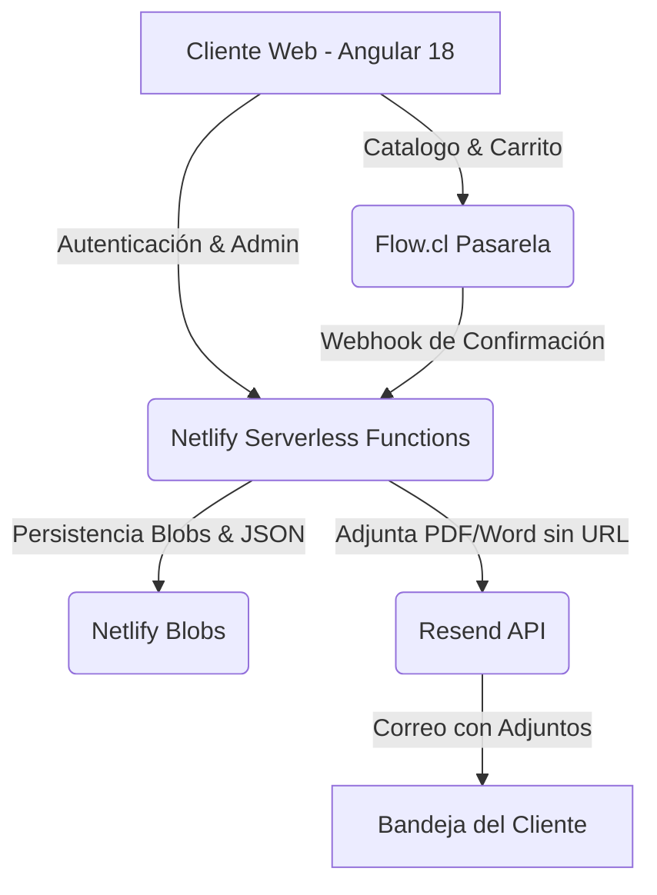

# 🎓 La Profe GPT - Sitio Web & Plataforma E-Commerce

[](https://angular.dev/)
[](https://tailwindcss.com/)
[](https://www.netlify.com/)
[](https://www.flow.cl/)
[](https://resend.com/)

Plataforma e-commerce oficial de **La Profe GPT**, diseñada para la venta y despacho automático de asistentes **Custom GPTs** y paquetes de recursos pedagógicos digitales protegidos para docentes en Chile (Portafolio Docente, Evaluaciones ECEP, Dossiers y Bibliotecas).

---

## 🌟 Características Principales

### 🛍️ Experiencia del Cliente (E-Commerce)
- **Catálogo Interactivo**: Explorador de los 39+ paquetes pedagógicos con filtros por categoría (Portafolio, ECEP, Dossier, Biblioteca) y buscador en tiempo real.
- **Carrito Flotante & Checkout**: Gestión fluida de ítems, resumen de compra y validación de correo electrónico.
- **Integración con Flow.cl**: Pagos 100% seguros mediante Webpay, tarjetas de crédito y débito.
- **Despacho Automático por Correo**: Tras completar el pago, el cliente recibe un correo instantáneo impulsado por **Resend API** con acceso directo a sus Custom GPTs y archivos PDF/Word adjuntos nativamente en su bandeja de entrada.

### 🛡️ Panel de Administración Privado (`/admin`)
- **Autenticación Protegida**: Inicio de sesión seguro con JWT (`/admin/login`).
- **Gestor de Productos & Paquetes**:
  - Creación y edición de paquetes con **IDs autoincrementales automáticos** (`prod-039`, `prod-040`).
  - **Soporte Multi-Recurso**: Asignación de 1 o más enlaces a Custom GPTs y 1 o más archivos adjuntos por producto.
- **📁 Mantenedor de Documentos Protegidos (Bóveda Backend)**:
  - Almacenamiento en la carpeta privada `netlify/functions/assets/documents/`.
  - Subida física de archivos binarios (PDF, Word, Docs) desde tu equipo mediante selector interactivo.
  - **Protección de Eliminación**: Alerta emergente explicativa en rojo que bloquea la eliminación si un documento está asignado a algún producto activo.
  - **Galería Modal de Selección**: Selector de pantalla grande con vista Grilla/Lista, control de Zoom y Visor Previo en pantalla con lector PDF (👁️).

---

## 🚀 Arquitectura Tecnológica ($0 CLP/mes de costo fijo)

El proyecto utiliza una arquitectura Serverless Jamstack optimizada para operar a $0 CLP/mes de costo fijo:



### Stack Técnico:
- **Frontend**: Angular 18 (Standalone Components, Signals & Control Flow `@for`/`@if`).
- **Diseño & Estilos**: Vanilla CSS + Tailwind CSS (Paleta corporativa HSL: Purple `#7C3AED` & Pink `#DB2777`).
- **Backend Serverless**: Netlify Functions (TypeScript).
- **Persistencia**: Netlify Blobs (`@netlify/blobs`) + JSON.
- **Pasarela de Pagos**: Flow.cl API v1.
- **Servicio de Email**: Resend API.

---

## 📁 Estructura del Proyecto

```text
la-profe-gpt-sitio-web/
├── netlify/
│   └── functions/
│       ├── admin-auth.ts          # Autenticación JWT de Administrador
│       ├── admin-documents.ts     # CRUD de Bóveda Privada de Documentos
│       ├── admin-products.ts      # Gestión de Catálogo y Bóveda Privada
│       ├── create-payment.ts      # Integración con Flow.cl
│       ├── flow-webhook.ts        # Receptor de confirmaciones de pago
│       ├── assets/documents/      # Carpeta de Documentos Privados Backend
│       └── shared/
│           ├── email-service.ts   # Despacho de adjuntos nativos por Resend API
│           ├── flow-client.ts     # Cliente de firmas HMAC-SHA256 para Flow.cl
│           ├── netlify-blobs.ts   # Persistencia Netlify Blobs + Fallback local
│           └── private-vault.ts   # Bóveda Privada de accesos digitales
├── src/
│   ├── app/
│   │   ├── core/
│   │   │   ├── guards/            # AdminGuard para protección de rutas
│   │   │   ├── models/            # Interfaces de Producto, Carrito y Documentos
│   │   │   └── services/          # AdminService, ProductService, CartService
│   │   ├── features/
│   │   │   ├── admin/             # Dashboard y Login de Administración
│   │   │   ├── catalog/           # Página de Catálogo de Productos
│   │   │   ├── checkout/          # Pantalla de Pago y Datos de Cliente
│   │   │   ├── home/              # Página Principal (Hero, Beneficios, FAQs)
│   │   │   └── payment-status/    # Confirmación de Pago Exitoso
│   │   └── shared/                # Componentes Navbar, Footer, CartDrawer
│   └── assets/data/products.json # Catálogo inicial de productos
├── netlify.toml                   # Configuración de Build y Redirecciones
└── package.json                   # Dependencias del Proyecto
```

---

## 🔧 Instalación y Configuración Local

### Requisitos Previos
- **Node.js**: v18.0.0 o superior
- **npm**: v9.0.0 o superior

### 1. Clonar el Repositorio
```bash
git clone https://github.com/yoisbarahonab-prog/la-profe-gpt-sitio-web.git
cd la-profe-gpt-sitio-web
```

### 2. Instalar Dependencias
```bash
npm install
```

### 3. Configurar Variables de Entorno
Crea un archivo `.env` en la raíz del proyecto basándote en `.env.example`:

```env
# Credenciales del Administrador
ADMIN_EMAIL=admin@laprofegpt.cl
ADMIN_PASSWORD=ProfeAdmin2026!
JWT_SECRET=tu_secreto_jwt_super_seguro

# Flow.cl Pasarela de Pago
FLOW_API_KEY=tu_flow_api_key
FLOW_SECRET_KEY=tu_flow_secret_key
FLOW_API_URL=https://sandbox.flow.cl/api

# Resend API Envíos por Correo
RESEND_API_KEY=tu_resend_api_key
EMAIL_FROM=La Profe GPT <contacto@laprofegpt.cl>
```

---

## 🏃‍♂️ Ejecución en Desarrollo

### Opción A: Servidor Angular Standalone
```bash
npm run start
```
Abre en tu navegador [http://localhost:4200/](http://localhost:4200/).

### Opción B: Entorno Completo con Netlify CLI (Recomendado)
Para simular el servidor de producción con Angular + Netlify Functions + Netlify Blobs:
```bash
npx netlify dev
```
Abre en tu navegador [http://localhost:8888/](http://localhost:8888/).

---

## 🔐 Acceso al Panel de Administración

- **Ruta**: `http://localhost:4200/admin/login` (o desde el enlace en el pie de página).
- **Correo**: `admin@laprofegpt.cl`
- **Contraseña**: `ProfeAdmin2026!`

---

## 🛠️ Compilación para Producción

Para construir el paquete de producción optimizado:
```bash
npm run build
```
Los archivos compilados se generarán en `dist/profe-gpt-app/browser` listos para ser desplegados en Netlify.

---

## 📄 Licencia

Desarrollado exclusivamente para **La Profe GPT** © 2026. Todos los derechos reservados.
